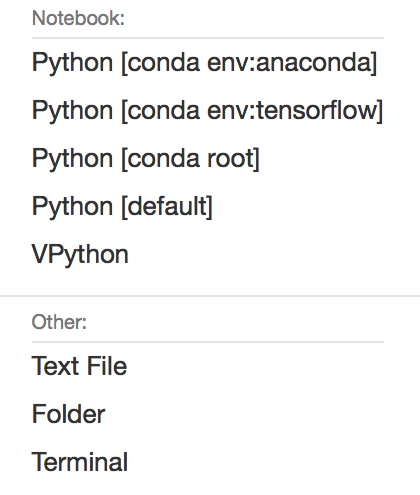
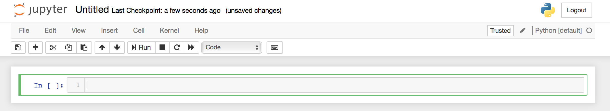
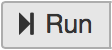
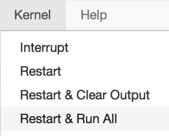
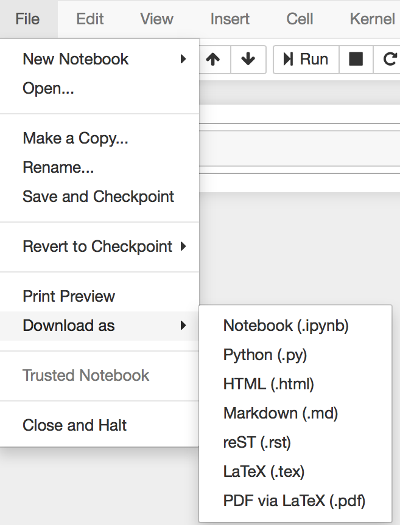
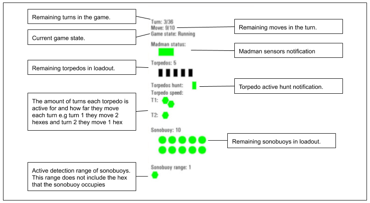
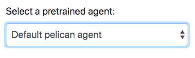
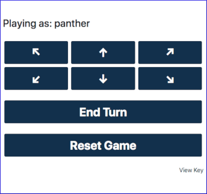
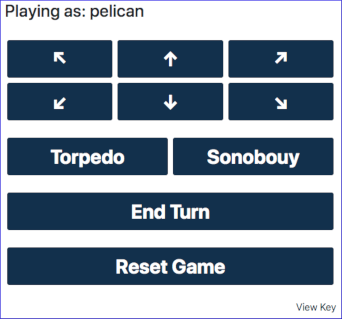

{width=100%}

# Hunting the Plark documentation

Copyright 2020 Montvieux Ltd

Licensed under the Apache License, Version 2.0 (the "License");
you may not use this file except in compliance with the License.
You may obtain a copy of the License at

    http://www.apache.org/licenses/LICENSE-2.0

Unless required by applicable law or agreed to in writing, software
distributed under the License is distributed on an "AS IS" BASIS,
WITHOUT WARRANTIES OR CONDITIONS OF ANY KIND, either express or implied.
See the License for the specific language governing permissions and
limitations under the License.

# Introducing the Hunting of the Plark AI testbed

The Hunting of the Plark AI testbed has been created to support this Hackathon activity at the Alan Turing Institute (ATI). During this event, participants from academia will be invited to explore the application of Artificial Intelligence (AI) techniques to solving a representative military problem within a computer wargaming environment - the so called 'Hunting the PLARK' scenario. This scenario is based on the game designed by John Salt at Cranfield University.

The objective of the event for will be to observe and understand the approaches taken by participants through the training, modification and optimisation of the initial Machine Learning (ML) algorithms provided.

The software has been developed for technical audience to explore a wide range of potential approaches. This had led to some trade-offs: 

* Some complexity has been added to reduce coupling between any particular machine learning algorithm and the environment.
* Some complexity has been added as a consequence of allowing a huge variation in game settings and options (essential for research into generalisable agents).

Due to this complexity the software may contain errors or inaccuracies and may not function as well as commercially released software. 

The Hunting the Plark scenario is based on a maritime patrol aircraft hunting a submarine (the Plark) within a computer simulated game environment consisting of defined, but changeable rules, under the direction of the host game controller and participants. The purpose of varying the game rules is twofold:

-   It will be used to determine how well the implemented AI techniques can cope with different situations and different opposing strategies, whether playing against other AI algorithms, or human operators.

-   The hackathon participants will be able to use the flexible simulation to train agents in various situations. This flexibility is essential to allow the training of agents in more simplified environments before advancing to more challenging environments which would be impossible to use as a starting point.

# Hunting The Plark original paper game

The Hunting the Plark game used in this software was based off the original "The Hunting of the Plark" game by John Salt at Cranfield University. The game has been adapted to allow the creation of autonomous agents and to allow different scenarios to be created. These files are provided as a reference to the original source material and **do not** represent the current state of the game.

[Hunting of the Plark Zip File](./Documentation/paper_game/HOTP.zip) *(this contains all of the files)* 

[Game rules](./Documentation/paper_game/The%20Hunting%20of%20the%20PLARK%20v1_4.pdf)

[Map](./Documentation/paper_game/HOTP%20map.pdf)

[Counter sheet](./Documentation/paper_game/HOTP%20countersheet.pdf)

[Panther plot](./Documentation/paper_game/HOTP%20Panther%20plot.pdf)

[Weapon bay cards](./Documentation/paper_game/HOTP%20weapon%20bay%20cards.pdf)

[Weapon bay variant 1](./Documentation/paper_game/HOTP%20weapon%20bay%20variants-1.pdf)

[Weapon bay variants](./Documentation/paper_game/HOTP%20weapon%20bay%20variants.pdf)

# Setup

This section covers the basics of setting up an instance of Hunting The Plark, this is designed to the get the game up and running quickly. Additional guidance on how to modify and begin using each of these components is covered in various other sections of this guide. The environment has been designed to run on either CPU or GPU *(GPU providing faster training, but is not required)* within a Docker container.

* If you are new to Python a good starting point is [Here](https://www.w3schools.com/python/python_getstarted.asp)  

* If you are not familiar with Docker see the following [Docs](https://Docker-curriculum.com/)  

* If you just setting out on your journey with reenforcement learning you may find [this link](https://spinningup.openai.com/en/latest/index.html) interesting  

## System requirements

The following software is recomended before continuing to use the system.

-   Ubuntu 16.04.5 LTS / macOS High Sierra 10.13.6

-   NVIDIA Driver Release 418.87 or later

-   Docker Version 19.03.5 or later

-   CUDA Toolkit 10.0 *(for GPU processing)*

> Windows OS can be used however there are limitations, please see the [Windows and Docker](#Windows-and-Docker) section below.  

For using the web UI / Jupyter notebooks the below web browsers have
been tested:

-   Google Chrome version 80.0.3987.163

-   Safari version 13.1

> It has been noted that there can be caching issues while using some browsers. Disabling caching should resolve this.  


## GPU Docker image

The base of the GPU Docker image is in a Nvidia private repository.
Please sign up and sign in to Nvidia NGC, following this link to set up
an API key:

[https://ngc.nvidia.com/setup/api-key](https://ngc.nvidia.com/setup/api-key)

Before building the Docker container run the following:

    Docker login nvcr.io
    The username is: $oauthtoken
    The password is: your API key.


## Windows and Docker

On Windows the use of Docker is limited to CPU processing. This limitation is due to the Windows subsystem for Linux not being able to pass GPUs to Docker (This may change in late 2020). 

There are three options if using windows:

* Use the Docker CPU. For additional information regarding Docker configuration on Windows click [here](#windows-Docker-setup).

* Work outside of Docker in an Anaconda environment click [here](#Windows-Anaconda-Environment-Configuration-Instructions).

* Dual booting to [Ubuntu](https://ubuntu.com/tutorials/try-ubuntu-before-you-install#1-getting-started).

# Quick start

## Environment setup

>${PACKAGE_DIR} is referenced throughout these steps. This indicates
the location where you have cloned the game to.

Docker is used extensively throughout this guide. If you require more information about Docker arguments please see [Here](https://docs.Docker.com/engine/reference/run/)

## Step 1, Get the source code

Use git to clone the repository, or get the code in a zip file.

## Step 2, Build angular UI

The angular site is already built when getting a package from Montvieux, however if you are sourcing the code externally e.g. cloning from an external git repository or making a change to the angular code, a rebuild is required.
To build the angular web UI run the command below. This will build the angular site in the flask server directory.

    sh build_angular.sh  

## Step 3, Build the docker image 

Build the appropriate environment (CPU or GPU) using
the following:

GPU command:

    Docker build -t plark_ai -f ${PACKAGE_DIR}/Docker/Dockerfile  ${PACKAGE_DIR}/Docker

CPU command:

    Docker build -t plark_ai -f ${PACKAGE_DIR}/Docker/DockerfileCPU  ${PACKAGE_DIR}/Docker


## Step 4, Start a docker container

>*Please ensure that you have configured Docker to have access to more than the default 2GB of memory. This can be done in the Docker desktop preferences.*

Run the Docker container using one of the following commands:

GPU command:

    docker run --gpus 'device=0' -v ${PACKAGE_DIR}/Components:/Components \ 
    -v ${PACKAGE_DIR}/data:/data -p 8888:8888 -p 5000:5000 plark_ai 

>*replace the --gpus paramater with another GPU ID or all if needed*.

CPU command:

    docker run -v ${PACKAGE_DIR}/Components:/Components \ 
    -v ${PACKAGE_DIR}/data:/data -p 8888:8888 -p 5000:5000 plark_ai 

You should now be presented with a console window with the Docker container output.

* You should then be able to see the Jupiter notebook server at http://localhost:8888  

> jupyter notebook password:
> cloudywithachanceofamonia  

* Navigate to the URL http://localhost:5000 you will be presented with the Web UI.

## Alternative

Loading from a pre-packed docker tar:  
* packaged_plark_ai_cpu.tar is a saved down docker image (you may have been provided this as the result of running the packaging script in plark_ai/Deployment/package/package.sh). 
* This means that you can test the system but any changes and trained agents will not save down to your host machine (without doing some extra volume mappings or copying files). 
* To run this simply do the following steps: 

    docker load -i packaged_plark_ai_cpu.tar  
    docker run -p 8888:8888 -p 5000:5000 packaged_plark_ai_cpu
* You should then be able to see the Jupiter notebook server at http://localhost:8888  

> jupyter notebook password:
> cloudywithachanceofamonia  

* Navigate to the URL http://localhost:5000 you will be presented with the Web UI.

## Port mapping 

Docker containers have the ability to expose services to the host machine (your physical machine running Docker). When running the Docker commands in these guides it is assumed that the below ports are all free on your system running Docker. These ports can be modified depending on your port availability. Simply change the port number on the left of the : to a free port and update the following URLs as needed below.

   * port `8888` is used for Jupyter Notebook
   * port `5000` is used for the Web UI
   * port `6006` is used for the tensorboard   

## Interact with The Environment

There are three ways to interact with the environment:

*   **Jupyter Notebook** Allows an interactive python environment for training and evaluating models, this can also be used to create basic agent if required.  
    * Navigate to the URL [http://localhost:8888](http://localhost:8888)
    * You will be presented with an Jupyter Notebook instance.
    * Jupyter Notebook password:  cloudywithachanceofamonia

> *This is not recommended for large scale training as the Jupyter Notebook content can use a lot of memory and the kernel can restart during the training process causing the loss of the model.*

*   **Web UI** - This provides a web-based game UI allowing the selection of agents and game configurations, along with human control of both the Panther or the Pelican.
    * Navigate to the URL [http://localhost:5000](http://localhost:5000)

*   **Scripting** - Similar to the Jupyter Notebook approach, however better suited for longer trainer and evaluation with less overhead. Please connect an interactive shell session to the Docker container using a run command. 

> Docker ps # This will provide a container ID/name.  
> Docker exec -it <ID of above Docker container> /bin/bash

## Running Docker In interactive mode

If you would like more control over running serevices it is possible to run interactively.   

You can run Docker in interactive mode where after executing you should have a bash shell that is inside the Docker container.  

    docker run -v D:\Projects\PlarkBeta\plark_ai\Components:/Components \
    -v D:\Projects\PlarkBeta\plark_ai\data:/data -p 8888:8888 -p 5000:5000 -it plark_ai /bin/bash
    or
    docker run -v ${PACKAGE_DIR}/Components:/Components \
    -v ${PACKAGE_DIR}/data:/data -p 8888:8888 -p 5000:5000 -it plark_ai /bin/bash

Note the addition -it and /bin/bash parts. 
Then inside Docker execute: 

    cd / 
    sh run_servers.sh

## Web UI

The angular site is already built when getting a package from Montvieux, however if you are sourcing the code externally e.g. cloning from an external git repository or making a change to the angular code, a rebuild is required.
To build the angular web UI run the command below. This will build the angular site in the flask server directory.

    sh build_angular.sh  

Running the below command will set up the pip modules, start-up both the Jupyter Notebook, and the Web UI that is served by the flask server. This is normally run automatically by Docker though.

    sh run_servers.sh

Navigate to the URL [http://localhost:5000](http://localhost:5000) you will be presented with the Web UI.

## Jupyter Notebook

If starting a Docker container interactively or if you have shut down
the Jupyter/flask server you can start them using this command inside
the Docker container.  

Running the below command will set up the pip modules, start-up both the Jupyter Notebook, and the Web UI that is served by the flask server. This is normally run automatically by Docker though.

    sh run_servers.sh

-   Navigate to the
    URL [http://localhost:8888](http://localhost:8888)

-   You will be presented with an Jupyter Notebook instance.

-   Jupyter Notebook password: cloudywithachanceofamonia

## Scripts

Once up and running (locally or remote) connect to the Docker container
using the following command:

    Docker ps # This will provide a container ID/name.  
    Docker exec -it <ID of above Docker container> /bin/bash

## Remote Server Access

If you are accessing a remote server, you will need to open another shell and forward the required service ports by executing the following:

Jupyter Notebook

    ssh -N -L 8888:localhost:8888 User@YourIP

Web UI

    ssh -N -L 5000:localhost:5000 User@YourIP

Tensorboard

    ssh -N -L 6006:localhost:6006 User@YourIP

This will enable access of remote services from your local machine.

## Windows Anaconda Environment Configuration Instructions

-   Download and Install Anaconda
    from [https://www.anaconda.com/](https://www.anaconda.com/)

-   Launch Anaconda Navigator

-   Click on 'Environments'

-   Create a new Python 3.6 environment called 'plark_ai'

-   Click on the newly created environment and open a terminal

### Install Tensorflow in the environment

If you have a GPU ensure that cuda 10 is installed and then install
Tensorflow GPU:

This software has been tested with [CUDA Toolkit
10.0](https://developer.nvidia.com/cuda-10.0-download-archive?target_os=Windows&target_arch=x86_64&target_version=10&target_type=exenetwork)

    pip install tensorflow-gpu==1.14

Otherwise intall tensorflow CPU:

    pip install tensorflow==1.14

### Installing Plark_ai dependencies in the environment

Then install the plark_ai dependencies:

    Change directory to the plark_ai package
    cd Docker
    pip install --upgrade -r requirements.txt

Then install the plark_ai pip modules:

    Change directory into the plark_ai package
    pip install -e Components/plark-game
    pip install -e Components/gym-plark
    pip install -e Components/agent-training

### Running Jupyter notebook server

Run this command from the command prompt to run the notebook as a background process:

    jupyter notebook &

The Jupyter Notebook Server should then automatically open up a browser
and be accessible on [http://localhost:8888/](http://localhost:8888/)

Alternatively, you can go back to Anaconda Navigator home Launch Jupyter Notebook.

> Note: It may need to be installed first.

Jupyter by default uses tokens which can cause issues, to set or reset a password this can be done from a terminal:

    jupyter notebook password

Then set a new password.

When a Jupyter Server is running navigate to the plark_ai package via the browser, from there go to:

[http://localhost:8888/Components/agent-training/agent_training/test_gym_env.ipynb](http://localhost:8888/Components/agent-training/agent_training/test_gym_env.ipynb)

Then run through that notebook. Please note that locations will need to be updated for the game config files and model paths.

If it is not possible to locate the plark_ai code from where you are running Jupyter Notebook, Jupyter Notebook's config may need to be adjusted. Please see the Jupyter Notebook documentation for how to do this.

### Running Tensorboard

To run Tensorboard:

-   Open a new terminal in the plark_ai environment via Anaconda navigator

-   Run the following command and set a log dir to the location specified in plark_ai/Components/agent-training/agent_training/self_play.py or other file that generates tensorboard logs:  

    tensorboard --logdir .

-   The Tensorboard logs will then be visualised at: [http://localhost:6006/](http://localhost:6006/)

### Running the User Interface

This is currently not recommended as there are a number of paths to update.

First update the hardcoded paths in plark_ai/Components/plark_ai_flask/plark_ai_flask.py

Then open a new terminal in the plark_ai environment via Anaconda navigator

Run the following commands updating locations as desired:

    export LC_ALL=C.UTF-8
    export LANG=C.UTF-8
    export FLASK_APP=/Components/plark_ai_flask/plark_ai_flask.py
    export FLASK_ENV=development
    flask run --host=0.0.0.0 &

Then navigate to [http://localhost:5000/](http://localhost:5000/) to access the web-based UI.

## Windows Docker setup

There are some extra steps or different ways of starting Docker in Windows.

If you can run through the steps in the link below you will have everything set up to run the CPU version.

<https://docs.Docker.com/Docker-for-windows/>

Another more experimental way of running Docker on windows is using hyperV steps for this are below:

<https://ubuntu.com/tutorials/tutorial-windows-ubuntu-hyperv-containers#1-overview>

Please note that the slashes in the path on the 'outside' or windows side of the docker container will be \ and on the inside will be /.  

# Jupyter Notebook

If you are not controlling the game from the UI you are likely controlling the game from code. Jupyter Notebook has been used extensively to allow developers to experiment with and further develop re-enforcement within the simulation environment

If you are unfamiliar with the mechanics of Jupyter Notebook there are several key areas of interest. When creating a new notebook file, you are generally asked to specify a language you wish to use on it. In the case of this project we use Python to develop our experiments.

{width=25%}

Once you have a Python defined file open of you or have opened one of the many files contained within this project will see that the page is broken down into cells

{width=100%}

Each cell represents a section of code that can be run independently. You can click inside each of these cells and then click the run button at the top of the screen. This triggers the running of the code just inside that cell.

{width=10%}

In most circumstances you will not need to run each cell at a time and in this instance, you can tell Jupyter Notebook to run all the cells sequentially.

This can be achieved through using the kernel menu item as follows:

{width=30%}

Once your notebook has finished executing, the results will be visible within the page or sometimes at the bottom. If something did not work as intended, jump back to the cell which caused the failure and then run the cells below it afterwards to check the result.

Jupyter Notebooks are saved as a .ipynb however if you wish to save the Python content back to a .py file for normal execution as a script you can do this by exporting from the notebook. You can do this through the file menu item and selecting Download As.

{width=50%}

# Game Configuration

Game configuration allows you to modify aspects of the game and tailor a unique environment or scenario. Configuration can be applied by writing/modifying a configuration file or by passing in kwargs.

## Overloading Parameters with Kwargs

Overloading a parameter with the kwargs allows for quick and small changes to be made, this change is temporary and only applies to the current running game. When instantiating an environment the folling code can be used, this will create an game with default parameters from the configuration file but will override the panther starting row and column.

env = gym.make('gym_plark:plark-env-sonobuoy-deployment-v0',pelican_start_row=3, pelican_start_col=4)

## Creating A Configuration File

Configuration files can be used when there is a wider range of parameters that you wish to change or if you want the change to be more permanent or distributable. For example, if you wish to train several agents with the exact same rules then creating a configuration file is more appropriate.

Configuration files are stored in `Components/plark-game/plark_game/game_config` and can also be located in your volume mapped drive if using Docker.

The configuration file is a json file but it must contain several sections `game_settings`, `game_rules`, and `render_settings`. An example configuration file can be seen below.

## Example

If you want to change the starting location of either the panther or pelican you would update the 'start_row' and 'start_col' setting in the relevant section if a parameter is not listed in the config file a default value will be applied. A full list of parameters is available in the [Configurable Settings](#configurable-settings) section.

    "game_settings": {
        "maximum_turns": 36,
        "map_width": 10,
        "map_height": 10,
        "driving_agent": "pelican",
        "max_illegal_moves_per_turn": 10
    },
    "game_rules": {
        "bingo_limit": 36,
        "winchester_rule": true,
        "escape_rule": true,
        "panther": {
            "move_limit": 1,
            "start_col": 5,
            "start_row": 9,
            "agent_filepath": "pantherAgent_random_walk.py",
            "agent_name": "Panther_Agent_Random_Walk",
            "render_height": 250 ,
            "render_width": 310
        },
        "pelican": {
            "move_limit": 10,
            "madman_range": 0,
            "agent_filepath": "pelicanAgent_3_buoys.py",
            "agent_name":"Pelican_Agent_3_Bouys",
            "default_torps" : 5,
            "default_sonobuoys": 10,
            "render_height": 250 ,
            "render_width": 310
        },
        "torpedo":{
            "speed":[2, 1],
            "turn_limit":2,
            "hunt": true,
            "search_range":2
        },
        "sonobuoy":{
            "active_range":1,
            "display_range": true
        }
    },
    "render_settings": {
        "hex_scale": 40,
        "output_view_all": true
    }

## Configurable Settings

All default values can be found in the relevant config files `Components/plark-game/plark_game/game_config/`

## Game Settings

| Parameter                    |     Type     | |
| -- | :-: | ---- |
| `maximum_turns`              |   Integer    | The maximum number of turns in the game. |
| `map_width`                  |   Integer    | The width of the mad in number of hexagons. |
| `map_height`                 |   Integer    | The height of the mad in number of hexagons. |
| `driving_agent`              | `Agent_Type` | The agent that will be controlling the flow of the game. |
| `max_illegal_moves_per_turn` |   Integer    | The maximum number of illegal moves that each agent may make, per turn. |

### Illegal moves  

Although it is up to the relevant training environment to decide whether and how re-enforcement learning agents should be penalised for attempting illegal moves, the core game sets a limit on the number of illegal moves that may be attempted per turn (for both agents), to prevent poor agent behaviour from causing an infinite loop. `max_illegal_moves_per_turn` controls the number of illegal moves each agent may attempt on any given turn, before the turn is forcibly ended.


### Game rules

| Parameter         |  Type   | Notes    |
| - | :-: | ------ |
| `bingo_limit`     | Integer | The number of turns before the pelican runs out of fuel and the game is ended. Setting this to 0 deactivates this game rule |
| `winchester_rule` | Boolean | When the aircraft has dropped all its torpedoes, and all torpedoes in the water have finished running. The game is ended    |
| `escape_rule`     | Boolean | When the panther starts its turn on the top edge of the map it is considered to have escaped. The game ends.  |

### Panther

| Parameter        |  Type   | Notes    |
| - | :-: | ------ |
| `move_limit`     | Integer | The amount of hexagons a panther can move during a single turn. If overloading this via the kwargs the value is `panther_move_limit`. |
| `start_col`      | Boolean | The default setting is calculated based on map size so doesn't have a location in the configuration file. This location can be overloaded using `pelican_start_col` or a value can be added in the config file under `game_rules` -> `pelican` -> `start_col` |
| `start_row`      | Boolean | The default setting is calculated based on map size so doesn't have a location in the configuration file. This location can be overloaded using `pelican_start_row` or a value can be added in the config file under `game_rules` -> `pelican` -> `start_row` |
| `agent_filepath` | String  | The file path to the agent, this will be within `/data/models/`. If overloading this via the kwargs the value is `panther_agent_filepath`.                            |
| `agent_name`     | String  | The agent name, if overloading this via the kwargs the value is `panther_agent_name`.  |
| `render_height`  | Integer | The render height of the agent. If overloading this via the kwargs the value is `panther_render_height`.  |
| `render_width`   | Integer | The render width of the agent  If overloading this via the kwargs the value is `panther_render_width`.  |

### Pelican


| Parameter    |  Type   | Notes   |
| - | :-: | ------ |
| `move_limit` | Integer | The amount of hexagons a Pelican can move during a single turn. If overloading this via the kwargs the value is `pelican_move_limit`.      |
| `start_col`  | Boolean | The default setting is calculated based on map size so doesn't have a location in the configuration file. This location can be overloaded using `pelican_start_col` or a value can be added in the config file under `game_rules` -> `pelican` -> `start_col`. |
| `start_row`  | Boolean | The default setting is calculated based on map size so doesn't have a location in the configuration file. This location can be overloaded using `pelican_start_row` or a value can be added in the config file under `game_rules` -> `pelican` -> `start_row`. |
| `agent_filepath`    | String  | The file path to the agent, this will be within `/data/models/`. If overloading this via the kwargs the value is `pelican_agent_filepath`. |
| `agent_name`        | String  | The agent's name. If overloading this via the kwargs the value is `pelican_agent_name`.                                                           |
| `madman_range`      | Integer | The range in which the mad man sensor detects the panther.                                                                                                                                                     |
| `default_torps`     | Integer | The number of torpedos the pelican is equipped with.                                                                                                                                                           |
| `default_sonobuoys` | Integer | The number of sonobuoys the pelican is equipped with.                                                                                                                                                          |
| `render_height`     | Integer | The render height of the agent. If overloading this via the kwargs the value is `pelican_render_height`.                                                                                                      |
| `render_width`      | Integer | The render width of the agent  If overloading this via the kwargs the value is `pelican_render_width`.                                                                                                        |

#### Torpedo

| Parameter      |   Type    | Notes  |
| - | :-: | ------ |
| `turn_limit`   |  Integer  | The amount of turns a torpedo is active for.          |
| `speed`        | Integer[] | The amount of hexes a torpedo can move in a given turn. There needs to be an equal number of speed setting to turn_limit.                                                         |
| `hunt`         |  Boolean  | If active the torpedo will search within a given range if a metal object is found it will navigate toward the item. If not active the torpedo will stay stationary for its turns. |
| `search_range` |  Integer  | The number of hexes the torpedo can detect objects in.                                                                                                                            |


#### Sonobouy 

| Parameter       |  Type   | Notes                                                     |
| - | :-: | ------ |
| `active_range`  | Integer | The number of hexes that a sonobouy can detect around it. |
| `display_range` | Boolean | If the detection range is displayed on the map.           |


### Render settings  

| Parameter  |  Type   |Notes |
| --------------- | :-----: | ----------------------------------------- |
| `hex_scale`       | Integer | This value sets the size of the rendered hexagons. <br> This is purely a cosmetic setting, the default value has been selected as a comprimise between a small file size and a AIgym usable image. <br> Increasing this value will increase the quality of the image. |
| `output_view_all` | Boolean | This value forces the game to render all UI elements for every player eg the pelican can see the plark. |

## Game difficulty Settings  

Several game configuration files have been created in `Components/plark-game/plark_game/game_config/` for 10x, 20x and 30x game sizes *(**currently** only 10x has been balanced fully)*.

Custom configuration files can be created along with custom basic agents *(see the basic agents in `Components/plark-game/plark_game/agents/basic`)*


### Pelican Configuration Files  

This section refers to the settings advised for training a Pelican agent, each difficulty is given a brief explanation as to the actions of the basic provided agent, full settings can be found in the relevant config json file. 

#### Very Easy  

*This has been balanced for 10x play*

The panther moves north, the pelican has a large movement and the sonobuoys have a reasonable range. Torpedoes hunt and are active for 2 turns with a total move of 5.

This is intended to be used to start training a pelican agent vs a panther agent in self play. 

#### Easy  

*This has been balanced for 10x play*

The panther moves north, the pelican has a large movement and the sonobuoys have a reasonable range. Torpedoes hunt and are active for 2 turns with a total move of 4 and a reduce search range.

This is intended to be the starting point for pelican agent training.

#### Medium   

*This has been balanced for 10x play*

The panther moves randomly north, the pelican has a reduced movement and the sonobuoys have a reduced range. Torpedoes hunt and are active for 2 turns with a total move of 3 and a reduce search range.

#### Hard  

*This has been balanced for 10x play*

The panther moves randomly north, the pelican has a reduced movement and the sonobuoys have a reduced range. Torpedoes hunt and are active for 2 turns with a total move of 2 and a reduce search range.

### Panther Configuration Files  

This section refers to the settings advised for training a Panther agent, each difficulty is given a brief explanation as to the actions of the basic provided, full settings can be found in the relevant config json file. 

#### Very Easy  

The 3 sonobuoys pelican agent is used to maximum free space. Sonobuoys have a small range and torpedos do not hunt. This is intended to help train an agent to escape.

#### Easy  

The 3 sonobuoys pelican agent is used to maximum free space. Sonobuoys have a small range and torpedos can hunt. 

#### Medium  

The 5 sonobuoys pelican agent is used to reduce free space. Sonobuoys have a medium range and torpedos can hunt with a larger search range. 

#### Hard  

The 3 sonobuoys pelican agent. Sonobuoys have a large range reducing free space but ensuring a clear path is available. Torpedos can hunt at full range. This is intended to challenge an agent to fine the clear space in the map

#### Impossible  

This is not a challenge! These are settings that will cause the game to become unwinnable for the agent, this is a warning to not push the settings too far.

*E.g. With the Pelican_Agent_Drop_Buoys on a 10x10 grid the entire map is covered within sonobuoys.  Search radius and the torpedos can also move significantly faster than the panther. Once detected the pelican will fly to within range and deploy torpedos.*  

## Game view

The game view has been designed to aid the machine learning process using simple shapes and colours to make recognition easier. The rendered game view consists of two section, the game board made up of hexes on the left, and the information console on the right. 

> It should be noted that the same information is passed to the non image based agents so neither has an advantage. 

{width=60%}

### Perspectives

During game play a range of information can be displayed dependant on the game settings.

The game view will largely stay the same throughout the game play, showing one of three different view perspectives:


### Panther view:
This game view is from the perspective of the panther. When using this perspective the player/agent will see the following on the board:

- Panther Icon
- Pelican Icon
- Sonobuoy Icons and area of effect
- Torpedo Icons 

The information console will be mainly blank only showing:

- game state
- move counter 
- turn counter


### Pelican view:

- Pelican Icon
- Sonobuoy Icons and area of effect
- Torpedo Icons 

The information console has more details showing:

- game state
- move counter 
- turn counter
- madmad status
- torpedo count
- torpedoes hunt status
- torpedo turn and movement counters
- sonobuoy count
- sonobuoy active range 

### All view:

The view all render option allows both agents to see all of the above information making it easier for agent to be initially trained this option can be configured by setting the `output_view_all` configuration option to true in any configuration file or parameter overload. 

## Information Console

{width=100%}

# Rules Based Agents

Rules based agents allow a set behaviour to be quickly made with repeatable actions that can be used to help train a Machine Learning based agent. The hunting the plark platform provides several pre built rule based agents as both a stepping stone to help get you started and show the process to allow you to create your own rule based agents.  

## Panther Agents 
The 2 provided panther agents are:
- `Panther_Agent_Move_North`, moves directly north. 
- `Panther_Agent_Random_Walk`, moves north west / north / north east randomly. 

## Pelican Agents
The provided panther agents are:
- `Pelican_Agent_5_buoys`
- `Pelican_Agent_3_buoys`
- `Pelican_Agent_any_size_grid`
  
*These agent may only work on 10x grid size due to the layout of the sonobuoys*

This agent deploys sonobuoys in key areas around the map as seen in the below images. As the difficulty increases the free space around the sonobuoys decreases. This is intended to help train the panther agent to avoid sonobuoys. 

### Pelican_Agent_3_buoys

{width=60%}

### Pelican_Agent_5_buoys

{width=60%}

### Pelican_Agent_any_size_grid

{width=60%}

## How To Make A Rules Based Agent

Basic agents can be created by extending either the `Pelican_agent` or `Panther_agent` classes dependant on the desired agent type. The rule based agent must include three functions `__init__`, `get_name` and `getAction`. 

#### Step 1)  

Import and extend the relevant agent class. 

    from plark_game.classes import Pelican_Agent 
    
    class Pelican_Agent_3_Bouys(Pelican_Agent):


#### Step 2)   

Define the `init`, `get_name` and `getAction` functions. Pay special attention to add `pass` to any functions that will not be extended.
The `getAction` function is what allows you to developed your rule based agent the following properties will be passed to the agent: 

* *obs*, this is the game observation typically used by openAI agents. It is required but not utilised in this example
* *pelican_player/panther_player*, this object holds information relevant to the current agent
* *global_sb*, a list containing the locations of all sonobuoys within the map  
* *global_torps*, a list containing the locations of all the torpedos within the map.  

Examples are below:

    def __init__(self):
        self.target_col = None
        self.target_row = None

    def get_name(self):
        pass

    def getAction(self, obs, gameboard, pelican_player, global_sb, global_torps):

#### Step 3)

Write your behaviour within the `getAction` function.

> The agent must return a single action from every call to step. This action should not block.

Each agent can perform a range of actions that can be found in the parent classes `ACTION_LOOKUP` and in the below tables 

#### Pelican Actions

|  Action ID   |  Description  |
| :----------: | :-----------: |
|      1       |      Up       |
|      2       |   Up right    |
|      3       |  Down right   |
|      4       |     Down      |
|      5       |   Down left   |
|      6       |    Up left    |
|  drop_buoy   | Drop sonobuoy |
| drop_torpedo | Drop torpedo  |
|     end      |   End turn    |

#### Panther Actions

| Action ID | Description |
| :-------: | :---------: |
|     1     |     Up      |
|     2     |  Up right   |
|     3     | Down right  |
|     4     |    Down     |
|     5     |  Down left  |
|     6     |   Up left   |
|    end    |  End turn   |


# Agent training

## Stable Baselines

The example agents have been implemented using the Stable Baselines python library, which is a set of improved implementations of Reinforcement Learning (RL) algorithms based on OpenAI Baselines. This provides a set of implementations of Reinforcement Learning (RL) algorithms with a common interface. See the [stable-baseline](https://stable-baselines.readthedocs.io/en/master/) documentation for more details.

Stable-Baselines provides noticable improvements over OpenAI Baselines as seen below.

| **Features**                | **Stable-Baselines** | **OpenAI Baselines** |
| --------------------------- | -------------------- | -------------------- |
| State of the art RL methods | Yes                  | Yes                  |
| Documentation               | Yes                  | No                   |
| Custom environments         | Yes                  | Yes                  |
| Custom policies             | Yes                  | -                    |
| Common interface            | Yes                  | -                    |
| Tensorboard support         | Yes                  | -                    |
| Ipython / Notebook friendly | Yes                  | No                   |
| PEP8 code style             | Yes                  | Yes                  |
| Custom callback             | Yes                  | -                    |

We have mainly focused on several well known and regarded algorithms :

| **Algorithm** | **Description** | **Link** |
| - | --- | -- |
| DQN           | Deep Q Network (DQN) and its extensions (Double-DQN, Dueling-DQN, Prioritized Experience Replay)                                                     | [Further Details](https://stable-baselines.readthedocs.io/en/master/modules/dqn.html)  |
| PPO2          | The Proximal Policy Optimization algorithm combines ideas from A2C (having multiple workers) and TRPO (it uses a trust region to improve the actor). | [Further Details](https://stable-baselines.readthedocs.io/en/master/modules/ppo2.html) |
| A2C           | A synchronous, deterministic variant of Asynchronous Advantage Actor Critic (A3C). It uses multiple workers to avoid the use of a replay buffer.     | [Further Details](https://stable-baselines.readthedocs.io/en/master/modules/a2c.html)  |

Stable Baselines also contains additional algorithms. Further investigation may reveal that these may prove to be useful.

| **Algorithm** | **Description** | **Link** |
| - | --- | -- |
| ACER          | Combines several ideas of previous algorithms: it uses multiple workers (as A2C), implements a replay buffer (as in DQN), uses Retrace for Q-value estimation, importance sampling and a trust region. | [Further Details](https://stable-baselines.readthedocs.io/en/master/modules/acer.html) |
| DDPG          | DDPG requires OpenMPI. DDPG uses Q values instead of value estimation. As a result will require additional modules before it works with Stable baselines.                                              | [Further Details](https://stable-baselines.readthedocs.io/en/master/modules/ddpg.html) |
| GAIL          | The Generative Adversarial Imitation Learning (GAIL) uses expert trajectories to recover a cost function and then learn a policy.                                                                      | [Further Details](https://stable-baselines.readthedocs.io/en/master/modules/gail.html) |
| HER           | Hindsight Experience Replay (HER) is a method wrapper that works with Off policy methods (DQN, SAC, TD3 and DDPG for example).                                                                         | [Further Details](https://stable-baselines.readthedocs.io/en/master/modules/her.html)  |
| PPO1          | The Proximal Policy Optimization algorithm combines ideas from A2C (having multiple workers) and TRPO (it uses a trust region to improve the actor).                                                   | [Further Details](https://stable-baselines.readthedocs.io/en/master/modules/ppo1.html) |
| SAC           | Soft Actor Critic (SAC) Off-Policy Maximum Entropy Deep Reinforcement Learning with a Stochastic Actor.                                                                                                | [Further Details](https://stable-baselines.readthedocs.io/en/master/modules/sac.html)  |
| TD3           | Twin Delayed DDPG (TD3) Addressing Function Approximation Error in Actor-Critic Methods.                                                                                                               | [Further Details](https://stable-baselines.readthedocs.io/en/master/modules/td3.html)  |
| TRPO          | Trust Region Policy Optimization (TRPO) is an iterative approach for optimizing policies with guaranteed monotonic improvement.                                                                        | [Further Details](https://stable-baselines.readthedocs.io/en/master/modules/trpo.html) |


## Agent Training Guide

This quick start guide has been created to help you to start training an agent and be able to create a video of the agent to view how well it is performing. By following the guide, you will use on of the pre-made training environments and start training a new agent. The agents model will be saved so it can be used in future training environments. 

## Loading The Jupyter Notebook

Use the information in the [quick start guide](#quick-start) to start the docker container. Once the docker container has been started, a Jupyter Notebook server and the website will be loaded. 

To access the Jupyter Notebook, open up a web browser and go to `localhost:8888`. Once the page has loaded, you will be asked for a password. This password is `cloudywithachanceofamonia`. 

You will now be presented with a listing of the directory structure of the repository. Click on the Components directory to view where the code is stored. 

## Running A Pre-made Example

In the `agent-training/agent_training/` directory you will see multiple Python Notebooks and Python files. Start by opening the `test_gym_env.ipynb` notebook, running this code you will be able to train a new pelican agent and view a video of it at the end. 

This code can be used as an example of how to start training a new agent. By loading the `panther-test.ipynb`, you can view an example of how to train a pather agent which is done in a similar way to the `test_gym_env` file. 

As well as the notebooks, you can see Python files. These files are a good example of how to create a new python file that can be used to set up your own training routines. By viewing the `sonobuoy_deploy_training.py` you can see an example of how to create a file for running your own training environment. The training environment for the `sonobuoy_deploy_training` is located at `Components/gym-plark/gym_plark/envs/plark_env_sonobuoy_deployment.py`. 

If you view this deployment file, you will see that initially it imports a `PlarkEnv` and two functions, `init` and `step`. The init function is a standard instantiation function with the step function defining what actions it can make and how it gets rewarded. For more information on creating your own gym environment see the [gym environments](#Gym-Environments) section.

By using this as an initial example, you can view all of the other examples to see how you can start to train a different agent or a different trait of the agent. Hopefully, these examples will allow you to start training your own agents with your own preferred traits. 

## Self play training 

Allowing trained models to play against each other is an approach that leads to high levels of performance. Self-play is the process of using the same current best model on both sides of the game. In this case as the game is not symmetrical the current best model for each agent is used.  

In this form of self-play one agent is trained at a time. Initially a Pelican agent is trained in an easy environment with a rules based Panther opponent until a certain performance is achieved. Then a Panther agent is trained against a snapshot of the Pelican agents until a certain performance is achieved. The Pelican agent is then trained against a snapshot of the Panther and so on. It would be possible to build upon this to create a league as with [AlphaStar](https://deepmind.com/blog/articlealphastar-mastering-real-time-strategy-game-starcraft-ii). 

# Gym Environments

The agent training scripts generally use algorithms in the OpenAI [Stable Baselines](http://stable-baselines.readthedocs.io) library to train agent models. These RL algorithm implementations use the OpenAI [Gym](http://gym.openai.com/docs/) interface to mediate interaction with game environments, applying the actions chosen by the RL agent and returning appropriate reward alongside an observation of the game state.

The core _Hunting The Plark_ Gym implementation is the [PlarkEnv](#plark_env) class, which provides everything needed to start training an agent. This includes providing image-based observations of the gameplay (as a human player would see), providing a main positive/negative reward for winning/losing a game as well as a smaller reward for dropping sonobuoys far apart and smaller penalties for making illegal moves or dropping sonobuoys too close together.

If the keyword argument random_panther_start_position=True is used on intialising the Plark_env or a class that extends it then the Panther starting position is randomised. This can changed in the reset method.  

Environments within the OpenAI baseline framework constitute the structure which configures how the game is played and how an agent is rewarded for the actions it takes within it. The use of these environments means that any training method that works with OpenAI environments can be applied to the Hunting the Plark platform, more details about the OpenAI environments can be found at http://gym.openai.com/docs/#environments.

Several example environments have been written to help facilitate the training of agents. All environment can be found in `Components/gym-plark/gym_plark/envs/`.  
These environments are listed below: 

  - [Plark_env](#plark_env)
  - [Plark_env_sparse](#plark_env_sparse)
  - [Plark_env_guided_reward](#plark_env_guided_reward)
  - [Plark_env_illegal_move](#plark_env_illegal_move)
  - [Plark_env_sonobuoy_deployment](#plark_env_sonobuoy_deployment)
  - [Plark_env_top_left](#plark_env_top_left)
  - [Plark_env_non_image_state](#plark_env_non_image_state)
  - [Panther_env_reach_top](#panther_env_reach_top)

Custom Environments can also be created to allow specific training situations that have not been provided for please see the guide on [custom environments](#custom-environments)

## Example Environments

### Plark_env

Gym ID: `plark-env-v0`


This is a basic environment that provides rewards for winning the game (for both Panther and Pelican), rewards for dropping sonobuoys but penalises for dropping them too close (pelican only) and penalises for performing an illegal move. 

This environment can be used at any stage however it is advised to perform a warm start before using this environment by using a more specific environment from below to train specific traits within the model.

    if self.env.activeGames[len(self.env.activeGames) -1].illegal_move == True:
        reward = reward - 0.1
    if self.driving_agent == 'pelican': #If it wasn't an illegal move.
        ## Reward for droping a sonobouy 
        if action == 'drop_buoy' and self.env.activeGames[len(self.env.activeGames) -1].illegal_move == False:
            self.globalSonobuoys = self.env.activeGames[len(self.env.activeGames)-1].globalSonobuoys
            if len(self.globalSonobuoys)>1: 
                sonobuoy = self.globalSonobuoys.pop()
                sbs_in_range = self.env.activeGames[len(self.env.activeGames)-1].gameBoard.searchRadius(sonobuoy.col, sonobuoy.row, sonobuoy.range, "SONOBUOY")
                sbs_in_range.remove(sonobuoy) # remove itself from search results
                if len(sbs_in_range) > 0:
                    reward = reward - 0.2 
                else:
                    reward = reward + 0.5
            else:
                reward = reward + 0.5   
    ...

     if self.status in ["ESCAPE","BINGO","WINCHESTER"]:
        if self.driving_agent == 'pelican':
            reward = -1 
            _info['result'] = "LOSE"
        elif self.driving_agent == 'panther':  
            reward = 1 
            _info['result'] = "WIN"
        else:
            raise ValueError('driving_agent not set correctly')
    if self.status == "PELICANWIN":
        if self.driving_agent == 'pelican':
            reward = 1 
            _info['result'] = "WIN"
        elif self.driving_agent == 'panther':  
            reward = -1 
            _info['result'] = "LOSE"
        else:
            raise ValueError('driving_agent not set correctly')

### Plark_env_sparse

Gym ID: `plark-env-sparse-v0`

This is a basic environment that provides rewards for winning the game (for both Panther and Pelican). 

This environment is recommended to use when you have a well performing agent, and you are looking to perform self play.  

    if self.status in ["ESCAPE", "BINGO", "WINCHESTER"]:
        if self.driving_agent == 'pelican':
            reward = -1
            _info['result'] = "LOSE"
        elif self.driving_agent == 'panther':
            reward = 1
            _info['result'] = "WIN"
        else:
            raise ValueError('driving_agent not set correctly')
    if self.status == "PELICANWIN":
        if self.driving_agent == 'pelican':
            reward = 1
            _info['result'] = "WIN"
        elif self.driving_agent == 'panther':
            reward = -1
            _info['result'] = "LOSE"
        else:
            raise ValueError('driving_agent not set correctly')

### Plark_env_guided_reward
 
Gym ID: `plark-env-illegal-move-v0`

This environment is a good environment to start training to hunt in, however it must be noted that this environment uses ground truth information of the plarks location in the map.  

    if  self.status == "PELICANWIN":    
        reward = reward + 1.0
    
    ## Reward for being directly over the plark    
    if self.new_pelican_col == self.plark_col:
        reward = reward + .6
    if self.new_pelican_row == self.plark_row:
        reward = reward + .6
    
    ## Reward for being closer to the plark
    if self.distance(self.new_pelican_col,self.plark_col) < self.distance(self.pelican_col, self.plark_col):
        reward = reward + .4
    else:
            ## Punish for being further from the plark
        reward = reward - .6
    if self.distance(self.new_pelican_row,self.plark_row) < self.distance(self.pelican_row, self.plark_row):
        reward = reward + .4
    else:
        ## Punish for being further from the plark
        reward = reward - .6
                
    if reward > 1:
        reward = 1
    if reward < -1:
        reward = -1
 
### Plark_env_illegal_move

Gym ID: `plark-env-illegal-move-v0`

This environment provides rewards for every action performed, however if that action is an illegal move the reward is replaced with a punishment. The environment provides no feedback on the game state as that information is irrelevant, encouraging the agent to explore the action space rather than win the game.

The illegal move flag can be accessed from anywhere that has access to the game and can be incorporated into any environment if desired. This can be seen in the `plark_env` by applying a smaller reward to continually reinforce the negativity of illegal actions. The code example below is used before any additional reward is calculated 

    if self.env.activeGames[len(self.env.activeGames) -1].illegal_pelican_move == True:
            reward = reward - 0.1

The panther agent has a similar illegal move flag that can be see in the below code example

    if self.env.activeGames[len(self.env.activeGames) -1].illegal_panther_move == True:
        reward = reward - 0.1


### Plark_env_sonobuoy_deployment

Gym ID: `plark-env-sonobuoy-deployment-v0`

This environment rewards the pelican for deployment of sonobuoys, halving the reward if its within range of other sonobuoys. Similar to `Plark_env_illegal_move` the environment provides no feedback on the game state as that information is irrelevant, encouraging the agent to explore the action space rather than win the game.

    reward = 0        
    self.globalSonobuoys = self.env.activeGames[len(self.env.activeGames)-1].globalSonobuoys

    ## Reward for dropping a sonobuoy 
    if action == 'dropdrop_buoy':
        reward = 1.00

    if len(self.globalSonobuoys) > 1 : 
        sonobuoy = self.globalSonobuoys[-1]
        sbs_in_range = self.env.activeGames[len(self.env.activeGames)-1].gameBoard.searchRadius(sonobuoy.col, sonobuoy.row, sonobuoy.range, "SONOBUOY")
        sbs_in_range.remove(sonobuoy) # remove itself from search results
        
        if len(sbs_in_range) > 0:
            reward = reward - 0.5  

### Plark_env_top_left

Gym ID: `plark-env-top-left-v0`

This environment is a very simple test environment, designed to move the pelican to the top left of the screen. This can be used to test that your configuration is working correctly.   

        reward = 0
        self.new_pelican_col = self.env.activeGames[len(self.env.activeGames)-1].pelicanPlayer.col
        self.new_pelican_row = self.env.activeGames[len(self.env.activeGames)-1].pelicanPlayer.row
        
        if self.new_pelican_col == 0: 
            reward = reward + .5 
        if self.new_pelican_row == 0: 
            reward = reward + .5 
        if self.new_pelican_col < self.pelican_col:
            reward = reward + .1
        if self.new_pelican_row < self.pelican_row:
            reward = reward + .1    
        if self.new_pelican_col > self.pelican_col:
            reward = reward - .3
        if self.new_pelican_row > self.pelican_row:
            reward = reward - .3
        
        
        if reward > 1:
            reward = 1
        if reward < -1:
            reward = -1   

### Plark_env_non_image_state

Gym ID: `plark-env-non-image-v0`

Based on the core `plark_env`, but provides observations as a simple state vector, rather than as an image. This should result in faster training with better results in many cases. Non image state is also an option that can be used in the other environments.  

### Panther_env_reach_top

Gym ID: `panther-env-reach-top-v0`

This environment is a very simple test environment, designed to move the panther to the top of the screen. This can be used to test that your configuration is working correctly.   

## Custom Environments 

For full instructions and information on using the stable baselines custom environments please see their documentation found [here](https://stable-baselines.readthedocs.io/en/master/guide/custom_env.html "stable-baseline readthedocs") or continue reading our quick getting running guide below.

The custom class **must** inherit from the base `PlarkEnv`

    class PlarkEnvSparse(PlarkEnv):

Any custom environment **must** have two functions included: 

#### __init__
The init function **must** call the parents init function using `super` this defines the action and observation spaces. 

    def __init__(self,config_file_path=None, verbose=False, **kwargs):
        # Update kwargs with desired parameters, i.e. driving_agent
        super(PlarkEnvSparse, self).__init__(config_file_path,verbose, **kwargs)

#### step
The step function is where you can define your custom rules and reward schemas. From within the step function you will be able to access any parameter in the environment(normal restrictions apply), see the above examples if required.  

The step function **must** return three parameters(more can be returned if required):

- `ob` - the new observation space, 
- `reward` - the reward achieved in this step,
- `done` - if the game has ended during this step.


### Registering the environment  

Registering the environment allows it to be utilised easily in any platform that follows the openAI/stable-baselines format.
To register your custom environment add the following code snipet into the following file `Components/gym-plark/gym_plark/__init__.py`, replacing the id and entry point to match your environment Adding any kwargs you require. You must also import your environment in the following file `Components/gym-plark/gym_plark/envs/__init__.py` From more information on the use of registers see the openAI documentation [here](http://gym.openai.com/docs/#the-registry "OpenAI the registry").

    register(
        id='plark-env-sparse-v0',
        entry_point='gym_plark.envs:PlarkEnvSparse',
        kwargs={
            'config_file_path':'/Components/plark-game/plark_game/game_config/10x10/balanced.json'
        }
    )

> **Note:** the id must end with a version number eg -v0

#### Using a Registered environment 

When normally instantiating an environment you would call 

    env = plark_env_sparse.PlarkEnvSparse(config_file_path='/Components/plark-game/plark_game/game_config/10x10/balanced.json')

Followed by training the model with the created env

    model = PPO2('CnnPolicy', env)

Using a registered environment you still instantiate the environment, however the environment no longer needs to be imported at the top of the file. In addition you no longer have to pass kwargs unless desired as the registered environment contains these, this helps with consistency when training agents.  

    env = gym.make('gym_plark:plark-env-sonobuoy-deployment-v0')
   
This both reduces a step needed to train the model and ensures that everytime an environment is used it is provided the same parameters (in this case assuming that the configuration json file is the same).

## Training Scripts

This section covers agent training scripts from a high level and breaks down what each of the experimental files do. These files are located in `/Components/agent-training/agent-training/`.

### helper.py

Helper is a utility class designed to help with general experimentation. 
It provides utility functions such as being able to save a model in a standardised way. It provides custom evaluation functionality to allow you to evaluate the models you have trained and receive metrics which are relevant and meaningful to Hunting The Plark. Other functions include being able to generate videos based on your trained agent.

### evaluate_algorithms.py and evaluate_algorithms.ipynb

This python file is capable of both vector and image based algorithm assessment. Using vectors instead of the images that are presented to the user in the webUI this adds another dimension to our reinforcement training.

### benchmark.py and benchmark.ipynb

Benchmark.py was designed to allow you to test and benchmark your trained models. Regardless of the model type these python files provide a framework to allow you see how quickly they are training. Using chart outputs they store the trained image along with various metrics. 

### illegal_move_training.py

Training a model to reach a reasonable level will likely involve multiple training stages. What we have here is a python experiment which demonstrates the use of an illegal move reward function teaching the model to only carry out legal moves.

### multi-stage-train.py

Multi-stage training within reinforcement learning approaches are fairly common. This python file experiments with that concept demonstrating the ability to train a model with varying difficulties. Starting off using an easy difficulty file initially and progressing to harder opponents. Please note that agents trained on an environment with a set observation space size cannot then be used with a different observation size. In the case of non image based agents this is achieved by setting the maximum global values when creating the observation space, by default this is set to 30x30, agents can be trained on any grid size below 30x30 without issue. In the case of image based agents the observation space is set by the render_width and render_height parameters, so it is possible to train agents on different size grids as long as the render width and height are the same. 

### non_image_state.ipynb

Switching from image based to non-image vector based re-enforcement training techniques requires a level of experimentation. This python class is designed to test vector based training and produce videos for visual inspection.

### self_play.py and self_play.ipynb

Allowing trained models to play against each other can lead to very high levels of performance. This is demonstrated within this file. Creating a league which dynamically adjusts which model plays another is the next step using this building block.

### vectorized_comparison.py

Comparison of standard training with single environment against parallel training with multiple simultaneous environments. Allows using either image or non-image vector based observations.

### test_gym_env.ipynb

One of the initial tests generated to demonstrate the use of openAI baselines. Regularly updated as the game is developed it provides an initial look at the result of your RL techniques in action. Provides the user with a video showing their model playing against an opponent.

### panther_training.py, panther-non-image-test.ipynb, panther-test.ipynb *(Panther specific)*

This example shows how a new Panther agent can be trained. It uses similar code to how a Pelican agent is trained. The main difference being that when the environment is loaded, a Panther specific environment is used which tells the agent that it will be controlling the Panther. The example environment is called `panther_env_reach_top` and will try to get the Panther agent to the top of the screen.

### sonobuoy_deploy_training.py  *(Pelican specific)*

As with the `illegal_move_training.py`, `sonobuoy_deploy_training.py` is used as a step in a multi-stage training regime to teach the model to deploy sonobuoys in a sensible pattern across the game board. This makes the model a more effective opponent spreading its capability across the map instead of being focused in a smaller area. In this file we have used environments which penalise the pelican when sonobouys are dropped closely together.

## Logging 

Recording and viewing training progress with tensorboard

### Using Stable-Baselines Built-In Tenorboard Support

[Stable Baselines](https://stable-baselines.readthedocs.io/en/master/) RL classes contain [built-in support](https://stable-baselines.readthedocs.io/en/master/guide/tensorboard.html) for logging training data to [Tensorboard](https://www.tensorflow.org/tensorboard).

A simple example from the Stable Baselines docs:

    ```python
    import gym

    from stable_baselines import A2C

    model = A2C('MlpPolicy', 'CartPole-v1', verbose=1, tensorboard_log="./a2c_cartpole_tensorboard/")
    model.learn(total_timesteps=10000)
    ```

This would log to `./a2c_cartpole_tensorboard/`. To serve up the logs with tensorboard, just run:

    ```bash
    tensorboard --logdir ./a2c_cartpole_tensorboard/
    ```

Then browse to `http://localhost:3000` to view the Tensorboard dashboard. You will need to apply the relevant port mapping when starting docker if tensorboard is running inside the docker container. See below for more detail.

### Customisable Logs using TensorboardX

Whilst Stable Baselines' built-in Tensorboard support is easy to use, it doesn't give much control over what data is logged and tends to produce impractically large log files (~350MB per log event). A more practical solution is to log to tensorboard ourselves, giving full control over what we record and what we don't.

[TensorboardX](https://tensorboardx.readthedocs.io/en/latest/) makes it easy to log data to Tensorboard. There is a working example in `Components/agent-training/agent_training/self_play.py`, a simplified example can be found below:

    ```python
    from tensorboardX import SummaryWriter

    steps = 0
    max_steps = 10000
    testing_interval = 200
    model = # Instantiate RL model
    tb_log_path = "tensorboard_example"
    tb_log_name = "example"
    writer = SummaryWriter(tb_log_path)

    while steps < max_steps:
        model.learn(testing_interval)    
        steps = steps + testing_interval
        # We need something to log
        # If not using stable-baselines built-in logging we must calculate average reward ourselves
        victory_count, avg_reward = helper.check_victory(model,env,trials = 4)
        tb_writer.add_scalar('{}_avg_reward'.format(tb_log_name), avg_reward, steps)
        tb_writer.add_scalar('{}_victory_count'.format(tb_log_name), victory_count, steps)
    ```

Whilst this requires a bit more work (e.g. we must calculate average reward ourselves) and log as much detail, it produces _much smaller logs_ (~4KB per event vs ~350MB).

### Viewing Tensorboard Logs

To view tensorboard logs (either after or during training), simply run the below command. This will serve tensorboard locally on port `6006`.

    ```bash
    tensorboard --logdir <path to tensorboard logs>
    ```

For example, using the `plark_ai` Docker container, expose port `6006` from the container:

    ```bash
    # Host system
    $ docker run --gpus 'device=0' -v ${PACKAGE_DIR}/Components:/Components \
    -v ${PACKAGE_DIR}/data:/data -p 8888:8888 -p 5000:5000 -p 6006:6006 plark_ai bash
    # Within container shell
    $ cd /Components/agent-training/agent_training && python self_play.py
    $ tensorboard --logdir /data/agents/models
    ```

# Web UI 

The Docker container contains both a web based UI and a Jupyter notebook server which will allow you to [create an agent](#Agent-Training-Guide) and testing it against other agents. 

### How To Launch The UI

Both the UI and [Jupyter Notebook](#Running-Jupyter-notebook-server) should be running if the Docker container is running, if not go to the [quick start guide](#quick-start-guide) and follow the instructions.
Once the docker container has been started, navigate to  `localhost:5000` to view the UI. When you do this you will see the following screen. 

{width=100%}

The default state of this screen is also shown in the image above. It will allow the user to start a new game where the user plays as a panther and it selects a pelican agent for the user to play against. To start playing this game mode then click the 'start game' button at the bottom right of the screen. 

By selecting the dropdown box under the text 'select a pretrained agent:' you can choose from different pelican agents to play against. The dropdown box can be identified by looking for its default text of 'Default pelican agent'. When you click on this you will see a list of all the agents you can select from. 

{width=40%}

Above the text 'Select a pretrained agent:' there is the text 'Select controller' with a dropdown box underneath it with the default text 'Agent'. By clicking on the dropdown box with the text 'Agent' you can select for the pelican to be played by a human. 

This option is also available on the panther side but in reverse. So the panther option defaults to being played by a 'human' but can be changed to be played by an agent. If the panther is selected to be played by an agent then you will be given the option to choose an agent to play against in the same way as you can select a pretrained agent for the pelican player. 

These options allow you to set up one of three possible game types:
1. Human panther Vs. Agent pelican
2. Agent panther Vs. Human pelican
3. Agent panther Vs. Agent pelican

#### Human Panther Vs. Human Pelican  

This mode is not supported and if you try to select it you will see the following message appear on the screen. 'Human VS human play is not supported'.

#### Human Panther Vs. Agent Pelican  

This is the default game mode when the UI is first started. When this game mode is started, you will see this view ...

{width=100%}

On the left hand side of the screen is the game board. On the right hand side of the screen are the controls that will allow you to move the panther in your preffered direction. 


##### The Controls  
  

{width=40%}

These controls will allow you to move the panther character. By clicking on one of the directional arrows, you will move the panther in that directions. If you want to end your turn then you can click on the button 'end turn'. The 'reset game' button will put the game back to its starting state. 

If you click on the 'view key' text, then you will see a list of what all the different objects will look like on the game board. 

#### Agent Panther Vs. Human Pelican  

By selecting the panther to be played by an agent, the user can then start a game as the pelican. The game board view is the same as the panther agent but you will have slightly different controls. The pelican is able to drop sonobuoys and torpedos which the panther is not able to. 

##### The Controls  
  

{width=40%}

Below the arrows, which are are the same as the panther controls, there are two extra buttons. These are titled 'torpedo' and 'sonobuoy'. By clicking on either of these buttons, you can place / drop either a torpedo or sonobuoy in the tile where the pelican is currently placed. 

#### Agent Panther Vs. Agent Pelican  

When you select to play an agent against another agent, you can use the dropdown lists to select a specific agent that you want to use. When you click the game start button, you will see a loading screen followed by a screen similar to the one pictured below. This streen will tell you which agent won the game as well as letting you view a video of what happened. 

{width=100%}

# Troubleshooting 

If you go to http://localhost:5000 and see this error "jinja2.exceptions.TemplateNotFound", you just need to run "sh build_angular.sh” in the root of the project and restart the docker image. 

# Version Information

Version 1.0.0

## Known Issues

- Update the git locations in the guides (quick start guide step 1).
- There is some hardcoding in the flask server that assumes the code is running inside docker. This could be changed to read ENV vars.
- There is some hardcoding in the tests that assumes the code is running inside docker. This could be changed to read ENV vars.
- There is some hardcoding in the agent training code that assumes the code is running inside docker. This could be changed to read ENV vars.
- There is no unit testing of the the flask server
- It is not possible to drop a torpedo or sonobuoy on the final step in the Pelican phase.
- The Pelican loadout has no maximum values, setting a large amount of torpedoes and or sonobuoys causes the UI to render off the screen.
- Torpedo search range is not present in non image or image based state.
- The Panther and Pelican start locations are currently not randomised, however these values can be easily overridden in the configuration files and there is some randomisation in the main Plark Env.
- In the UI if you select default panther agent or default pelican agent the system incorrectly defaults to a human controled pelican agent. 

## Future Work

- A phase to allow the agents to select their starting place.
- A phase to allow the Pelican agent to choose it’s loadout.
- Addition of layer and speed logic to effect sensitivity of sonobuoy.
- Decoys for both Pelican and Panther agents.
- Addition of multiple Pelican and Panther agents.
- Addition of targets for Panther agents.
- Performance improvements.
- Examples of other types of algorithm i.e. Genetic Algorithms (MM-NEAT) or Rolling Horizon Evolution Algorithms.
- Extend the self-play into a self-play league inspired by AlphaStar.
- Record games played by expert agents or humans and use these to warm-up agents. 


# Running Robot Framework Tests

**Robot Framework** is a generic [test automation](https://en.wikipedia.org/wiki/Test_automation "Test automation")  [framework](https://en.wikipedia.org/wiki/Software_framework "Software framework") for [acceptance testing](https://en.wikipedia.org/wiki/Acceptance_testing "Acceptance testing") and [acceptance test-driven development](https://en.wikipedia.org/wiki/Acceptance_test-driven_development "Acceptance test-driven development") (ATDD). It is a [keyword-driven testing](https://en.wikipedia.org/wiki/Keyword-driven_testing "Keyword-driven testing") framework that uses tabular test data syntax.[[1]](https://en.wikipedia.org/wiki/Robot_Framework#cite_note-Homepage-1)

## How to run the robot tests

To run the robot tests, navigate to the root directory.

Run build_angular to build the UI which will be used throughout the testing:

    sh build_angular.sh 

Run the following command to build the docker containers: 

    docker-compose build 

This will build the docker containers for the web application and the robot testing suite. 

Then run:

    docker-compose up 
 
 This will start the web server and run the robot tests on the application

## Current tests 

The current tests that are carried out are as follows: 

 1. Can the user can navigate to the Hunting the Plark webpage?
 2. Can the user can navigate to config Page and select a config?
 3. Can the user can select an agent to train with and start a game?
 4. Does the user has control over the game using directional keys?

More tests can be created using combinations of keywords to form user paths. 

## How the robot tests are organised

The robot test suite is located in the Docker section of the repository. It consists of 3 folders 

- Resources - This folder contains Page object files that contain keywords that represent actions that the user can perform on each page such as button clicks and text field entries. It also contains a Common,robot file for actions that are performed in each test. (opening and closing the browser for example). and a PlarkApp.robot 
- Results  - This folder contains the test results. They are html and can be viewed in a browser. 
- Tests - The tests that can be run using sequences of methods in the resource file can be run using the test script in this folder. 

# Run packaging script

If you would like to package the code up so that it can be run on a machine without internet access please run the following steps. 

cd Deployment/package
sh package.sh /srv/plark_ai/code_drop

Running the packaged code in docker for CPU: 

    docker load -i packaged_plark_ai_cpu.tar
    docker run -p 8888:8888 -p 5000:5000 packaged_plark_ai_cpu

Running the packaged code in docker for GPU: 

    docker load -i packaged_plark_ai.tar
    docker run -p 8888:8888 -p 5000:5000 packaged_plark_ai

# Run tests 

In main directory run:

    sh run_tests.sh 

This will rebuild angular, download test data, rebuild Docker, run tests

## Add new tests

Update /Components/packaged_plark_ai/Dockerfile with more tests at the bottom. 

# Updating the PDF documentation

Make changes to the the README.md

    docker run --rm --volume "`pwd`:/data" --user `id -u`:`id -g` pandoc/latex README.md -o Documentation/Hunting_The_Plark.pdf -V geometry:margin=1in -V linkcolor:blue \
    -V geometry:a4paper --indented-code-classes=code --toc
  


{width=100%}

